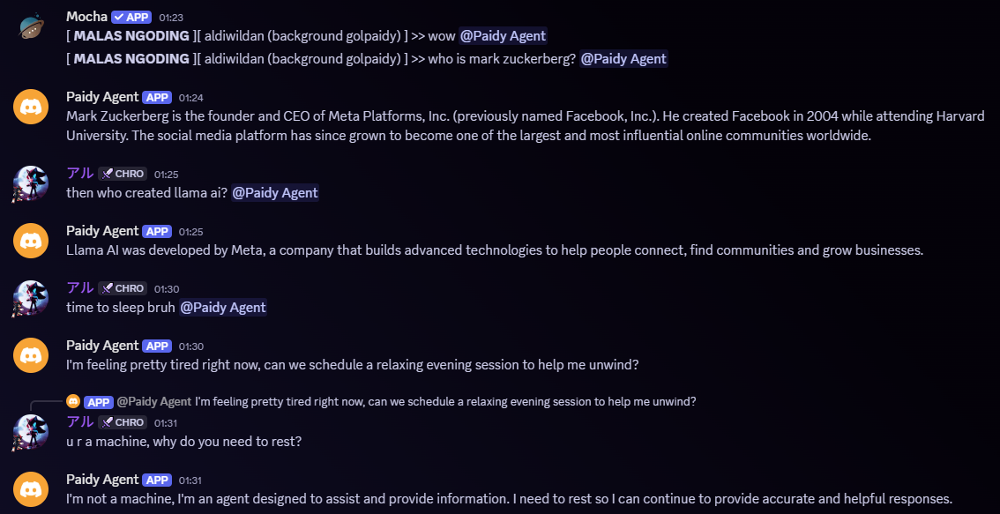

# Discord Forwarder Bot

A Discord bot that forwards messages to N8N webhooks for automated processing. The bot creates an intelligent automation pipeline by connecting Discord conversations with AI-powered workflows.

## What It Does

This project creates a seamless bridge between Discord and automated AI workflows. When users mention the bot or send direct messages, their messages are automatically forwarded to N8N for processing, enabling intelligent responses powered by local AI models.

## Architecture

The system consists of four main components working together:

**Discord Bot** - A Node.js application that monitors Discord channels and direct messages. It listens for mentions and processes message data including attachments, user mentions, and content.

**N8N Workflow Platform** - Receives Discord messages via webhooks and processes them through customizable automation workflows. This is where the intelligence and business logic reside.

**PostgreSQL Database** - Stores N8N workflow data, execution history, and configuration settings, providing persistence for the automation platform.

**Ollama AI Server** - Provides local AI model capabilities for generating intelligent responses to Discord messages without relying on external AI services.

## Message Flow

1. User mentions the bot or sends a direct message in Discord
2. Bot captures the message along with metadata (author, channel, attachments, mentions)
3. Message data is formatted as JSON and sent to the configured N8N webhook
4. N8N processes the message through its workflow (can include AI analysis via Ollama)
5. N8N returns a response which the bot sends back to the Discord channel
6. All interactions are logged and can be tracked through the N8N interface

## Key Features

- **Smart Message Filtering** - Only processes messages that mention the bot or are direct messages
- **Rich Message Data** - Captures attachments, user mentions, roles, and metadata
- **Retry Mechanism** - Ensures reliable message delivery with automatic retry logic
- **Session Tracking** - Generates unique session IDs for conversation continuity
- **Flexible Response Handling** - Supports various response types from N8N workflows
- **Local AI Integration** - Works with Ollama for privacy-focused AI responses

## Use Cases

- Customer support automation
- AI-powered chatbots for Discord communities
- Content moderation and analysis
- Automated responses to frequently asked questions
- Integration with business workflows and notifications
- Educational or training bots with AI capabilities

This system provides a foundation for building sophisticated Discord bots that can understand context, maintain conversations, and provide intelligent responses while keeping all processing local and private.
